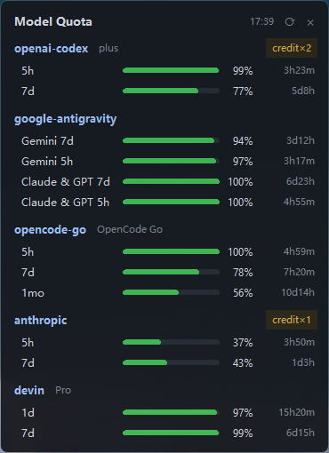
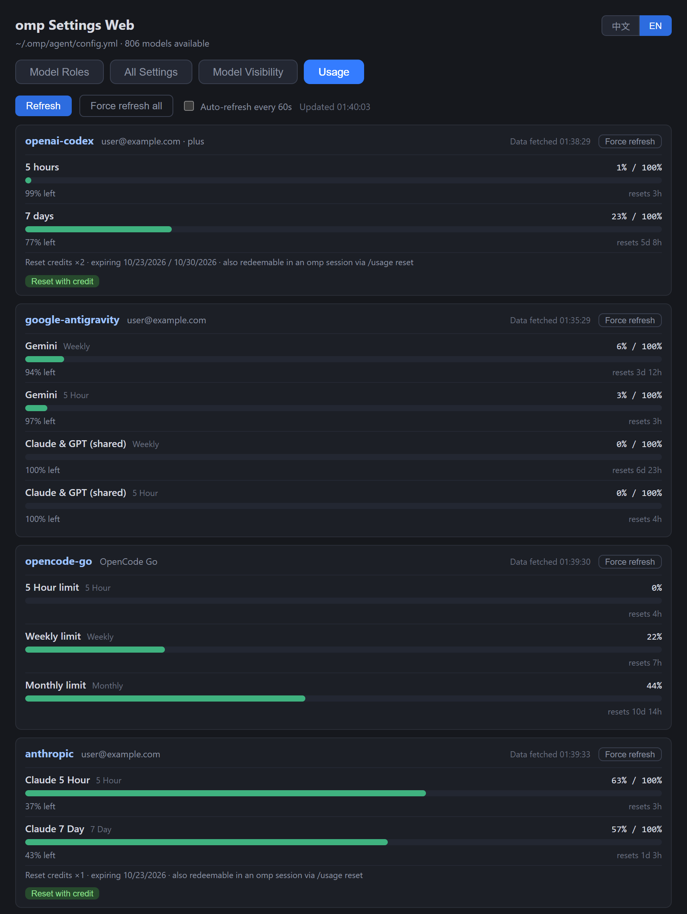
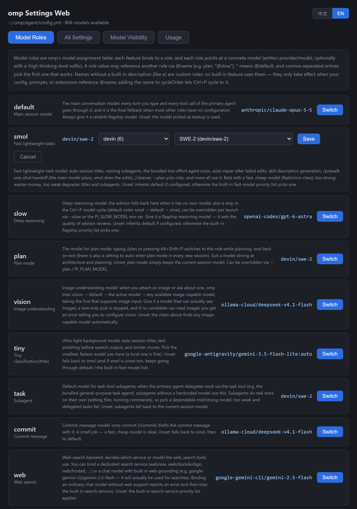
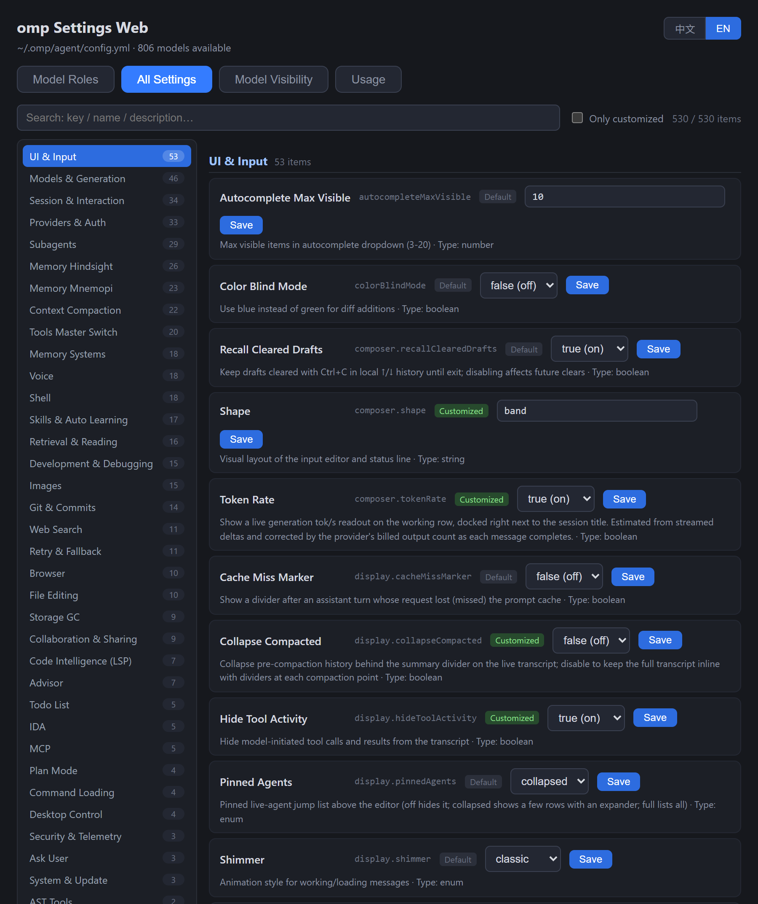
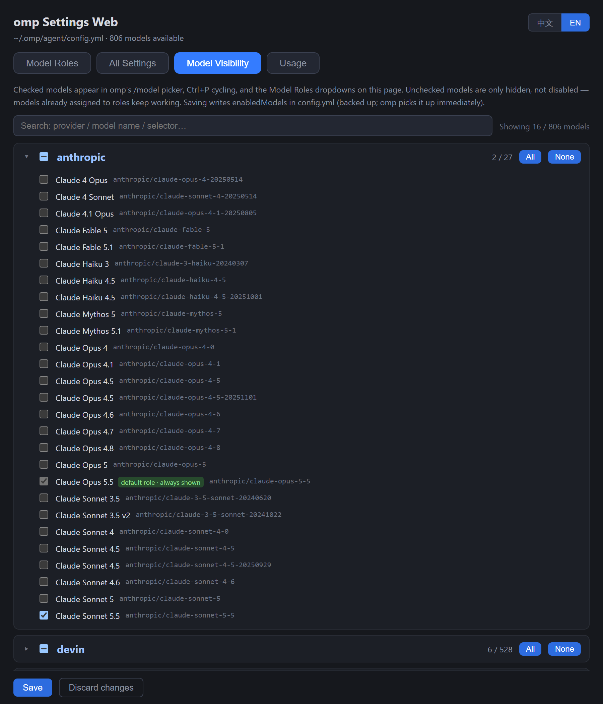

# omp Settings Web (omp-settings-web)

**[English](README.md) | [中文](README_CN.md)**

## Screenshots

**Desktop widget** — desktop-level panel (stays beneath app windows) showing remaining quota per provider:



**Usage dashboard** — per-provider quota cards with force-refresh and reset-credit redemption:



**Model roles** — beginner notes per role, two-level picker to switch models:



**All settings** — 529 keys in a categorized sidebar, each with an explanation:



**Model visibility** — choose which models appear in the `/model` picker:



## Features

**Model roles**

- Role matrix with two-level picker: provider group → model; auto-positions on the current value; `@role` aliases kept as a fallback entry.
- Each role shows a beginner-friendly explanation below it (which features use the role, what model to assign, and the fallback behavior when unset); a general note at the top explains the role mechanism (@aliases, *, comma candidates, custom roles).

**All settings**

- Full catalog from `omp config list --json` (500+ keys) with current values, types, and descriptions.
- All 529 keys carry detailed beginner-oriented Chinese names & explanations — what each value does, the default, when it is worth changing, and related settings (upstream English text is available on hover).
- Scalar settings (boolean / number / string / enum) are editable inline; array & nested block values are shown read-only.
- Sidebar category navigation: ~35 semantic categories sorted by size; search shows per-category hit counts and dims empty ones.
- Search + "only customized" filter; badges distinguish keys you have set from defaults.

**Model visibility**

- Choose which models appear in omp's `/model` picker, Ctrl+P cycling and this page's role dropdowns — per model or per provider, with search. Hidden models are **not disabled**: roles already assigned to them keep working. Writes `enabledModels` in `config.yml` (backed up, live-reloaded by omp); fully selected providers collapse to `provider/*`, the default role's model is pinned first and always shown, and patterns matching no current model (offline providers) are preserved.

**Usage**

- A visual dashboard mirroring `omp usage`: per-provider cards with progress bars for each rate-limit window (5h / 7d / weekly / monthly), used vs. remaining, live reset countdowns, account/plan info and reset-credit counts; shared windows are deduplicated. Manual refresh + per-provider or global force-refresh (`omp usage invalidate`, whitelist-validated) + optional 60s auto-polling, friendly empty/error states. **One-click "Reset with credit"** on anthropic/openai-codex cards — a confirmed click spends one saved reset credit through the same upstream protocol omp's `/usage reset` uses (server-side reimplementation of `resets.ts`; OAuth tokens are read from `~/.omp/agent/agent.db` and never leave the process).

**Desktop widget** (`widget.py`)

- A borderless dark mini window pinned to the desktop layer (never covers other apps) showing every provider's rate-limit windows from `omp usage --json` — compact bars showing remaining quota (colored by how much is left), remaining %, reset countdown, and a badge for saved reset credits. Runs standalone (no dependency on the web server), refreshes every 60 s, drag anywhere to move (position is remembered), right-click for refresh / force-refresh / open web panel / quit. Single-instance guarded; Win11 rounded corners; per-monitor DPI aware; `omp` subprocesses run without console windows.

## Requirements

- Python 3.8+ (standard library only, zero dependencies)
- [omp](https://github.com/can1357/oh-my-pi) installed and on `PATH` (used for `omp models --json`)

## Usage

```bash
python server.py            # starts http://127.0.0.1:8788 and opens your browser
python server.py --no-browser
```

Desktop widget:

```bash
pythonw widget.py           # no console window; right-click the widget for the menu
```

Open [http://127.0.0.1:8788](http://127.0.0.1:8788), click **Switch** on a role, pick a provider group, then a model, **Save**. The change applies immediately — running omp sessions pick it up, no restart needed.

## How it stays safe

`omp config set` rewrites the whole file and strips your comments. This tool never calls it. Instead:

1. **Targeted line edit** — reads `~/.omp/agent/config.yml` and regex-replaces only the target key's line; keys not yet present are inserted at the correct nesting level.
2. **Byte-precise I/O** — `read_bytes`/`write_bytes` with original line-ending detection (LF vs CRLF), so everything except the edited/inserted lines stays byte-identical.
3. **Automatic backup** — every write first copies the config to `config.yml.bak-settings-web-<timestamp>`.
4. **Type validation** — values are coerced per the type reported by `omp config list` (boolean/number/string/enum); arrays and nested blocks are read-only.

Server binds to `127.0.0.1` only. Value/role inputs are validated against a whitelist regex before touching the file.

> ⚠️ Pitfall worth knowing (and the reason for #2): on Windows, Python's `Path.write_text()` silently translates LF to CRLF, which would rewrite your entire config's line endings.

## API

| Endpoint | Method | Purpose |
|---|---|---|
| `/api/state` | GET | Current roles (parsed from config.yml) + full model catalog (`omp models --json`) |
| `/api/set` | POST | `{"role": "...", "value": "..."}` — backup + targeted write |
| `/api/settings` | GET | Full settings catalog (`omp config list --json`) + zh annotations + `__groupmap` |
| `/api/set-key` | POST | `{"key": "...", "value": "..."}` — type-coerced scalar write, backup + targeted line edit |
| `/api/usage` | GET | `omp usage --json` passthrough — per-provider quota/usage reports |
| `/api/usage/invalidate` | POST | `{"provider": "all"|<provider id>}` — whitelist-checked `omp usage invalidate`, forces re-fetch |
| `/api/usage/redeem` | POST | `{"provider": "anthropic"\|"openai-codex"}` — spends one saved reset credit via the same upstream calls as omp's `/usage reset` (two-step request_id confirm for Anthropic, single idempotent consume for Codex); structured `{ok, code, error}` responses, tokens never exposed |

## License

[MIT](LICENSE) — not affiliated with the omp project.
