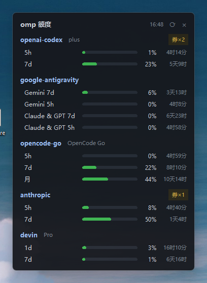

# omp 设置中心 / omp Settings Web (omp-settings-web)

A tiny local web UI for [oh-my-pi (omp)](https://omp.sh): switch model roles and edit all settings in Chinese, by clicking. The settings page organizes 500+ keys into ~35 sidebar categories, each entry with a curated Chinese name & description. A **中文 / EN** toggle in the header switches the entire UI to English — item names, descriptions, sidebar categories, buttons and messages (defaults to Chinese; the choice persists in localStorage). See the [English screenshot](docs/screenshot-settings-en.png).

一个本地 Web 小程序：浏览器里点击切换 omp 的 `modelRoles`、修改全部设置（中文界面），替代 TUI 内 `/model` 与手编 `config.yml`。改动写入后 omp 即时生效，无需重启会话。设置页把 500+ 项按 ~35 个大类做侧栏导航，逐项附中文名与中文说明。页头「中文 / EN」可一键把整个界面在中英文间切换（项名/说明/大类/按钮全量翻译，默认中文，选择存 localStorage 刷新保持），英文界面见 [截图](docs/screenshot-settings-en.png)。

| 模型角色 / Roles | 全部设置 / Settings |
|---|---|
|  |  |
|  |  |

设置页英文模式 / Settings page in English:


## Screenshots / 截图

| 桌面小窗 / Desktop widget | 用量面板 / Usage dashboard | 模型显示 / Model visibility |
|---|---|---|
|  |  |  |


## Features / 功能

**模型角色 / Model roles**

- Role matrix with two-level picker: provider group → model; auto-positions on the current value; `@role` aliases kept as a fallback entry. 两级选择（供应商分组→组内模型），自动定位当前值，别名兜底。
- Each role shows a beginner-friendly explanation below it (which features use the role, what model to assign, and the fallback behavior when unset); a general note at the top explains the role mechanism (@aliases, *, comma candidates, custom roles). 每个角色下方显示详细新手向说明（该角色被哪些功能用、配什么模型、未配置时的回退行为），页顶有角色机制通用说明（@别名、*、逗号候选、自定义角色）。

**全部设置 / All settings**

- Full catalog from `omp config list --json` (500+ keys) with current values, types, and descriptions. 全量设置目录，含当前值/类型/描述。
- All 529 keys carry detailed beginner-oriented Chinese names & explanations — what each value does, the default, when it is worth changing, and related settings (upstream English text is available on hover). 全部 529 项均有面向初学者的详细中文说明（每个取值的效果、默认值、何时值得改、相关设置），上游英文原文悬停可见。
- Scalar settings (boolean / number / string / enum) are editable inline; array & nested block values are shown read-only. 标量项可直接改，数组/嵌套块只读展示。
- Sidebar category navigation: ~35 semantic categories sorted by size; search shows per-category hit counts and dims empty ones. 设置页按 ~35 个语义大类做侧栏导航（按项数排序），搜索时侧栏显示各组命中数、零命中置灰。
- Search + "only customized" filter; badges distinguish keys you have set from defaults. 搜索 + 只看已自定义；徽章区分自定义项与默认值。

**模型显示 / Model visibility**

- Choose which models appear in omp's `/model` picker, Ctrl+P cycling and this page's role dropdowns — per model or per provider, with search. Hidden models are **not disabled**: roles already assigned to them keep working. Writes `enabledModels` in `config.yml` (backed up, live-reloaded by omp); fully selected providers collapse to `provider/*`, the default role's model is pinned first and always shown, and patterns matching no current model (offline providers) are preserved. 按模型/按供应商勾选哪些模型出现在 omp 的 `/model` 选择器、Ctrl+P 轮换和本页角色下拉中；未勾选只是隐藏、不是禁用，已分配给角色的模型照常可用。写入 `enabledModels`（自动备份，omp 即时生效）。

**用量 / Usage**

- A visual dashboard mirroring `omp usage`: per-provider cards with progress bars for each rate-limit window (5h / 7d / weekly / monthly), used vs. remaining, live reset countdowns, account/plan info and reset-credit counts; shared windows are deduplicated. Manual refresh + per-provider or global force-refresh (`omp usage invalidate`, whitelist-validated) + optional 60s auto-polling, friendly empty/error states. **One-click "Reset with credit"** on anthropic/openai-codex cards — a confirmed click spends one saved reset credit through the same upstream protocol omp's `/usage reset` uses (server-side reimplementation of `resets.ts`; OAuth tokens are read from `~/.omp/agent/agent.db` and never leave the process). 复刻 omp `/usage` 的可视面板：按供应商分卡的限额进度条（5 小时/7 天/周/月窗口）、已用与剩余量、重置倒计时实时跳动、账号/套餐信息与重置额度券；共享窗口自动去重。手动刷新 + 单供应商/全局「强刷」（`omp usage invalidate`，白名单校验）+ 可选 60 秒自动轮询，数据为空或拉取失败时给出提示而非白屏。anthropic / openai-codex 卡片支持「用券重置」——确认后经 omp `/usage reset` 同款上游协议消耗一张额度券（服务端复刻 `resets.ts`；OAuth token 从 `~/.omp/agent/agent.db` 读取，永不出进程）。


**桌面小窗 / Desktop widget** (`widget.py`)

- A borderless, always-on-top, dark mini window showing every provider's rate-limit windows from `omp usage --json` — compact bars colored by status, used %, reset countdown, and a badge for saved reset credits. Runs standalone (no dependency on the web server), refreshes every 60 s, drag anywhere to move (position is remembered), right-click for refresh / force-refresh / open web panel / quit. Single-instance guarded; Win11 rounded corners; per-monitor DPI aware; `omp` subprocesses run without console windows. 置顶无边框暗色小窗，直接读 `omp usage --json` 展示各供应商额度窗口（按状态着色的进度条、已用百分比、重置倒计时、额度券角标）；独立运行不依赖网页服务，60 秒自动刷新，任意处拖动且记住位置，右键可刷新/强制刷新/打开网页面板/退出；防双开、Win11 圆角、高分屏清晰、调用 omp 不弹控制台。


## Requirements / 依赖

- Python 3.8+ (standard library only, zero dependencies / 纯标准库，零第三方依赖)
- [omp](https://github.com/can1357/oh-my-pi) installed and on `PATH` (used for `omp models --json`)

## Usage / 使用

```bash
python server.py            # starts http://127.0.0.1:8788 and opens your browser
python server.py --no-browser
```

Desktop widget / 桌面小窗：

```bash
pythonw widget.py           # no console window; right-click the widget for the menu
```

Open [http://127.0.0.1:8788](http://127.0.0.1:8788), click **切换** on a role, pick a provider group, then a model, **保存**. The change applies immediately — running omp sessions pick it up, no restart needed.

打开页面 → 角色行点「切换」→ 选分组 → 选模型 → 保存。配置写入后 omp **即时生效**，运行中的会话无需重启。

## How it stays safe / 安全设计

`omp config set` rewrites the whole file and strips your comments. This tool never calls it. Instead:

1. **Targeted line edit** — reads `~/.omp/agent/config.yml` and regex-replaces only the target key's line; keys not yet present are inserted at the correct nesting level.
2. **Byte-precise I/O** — `read_bytes`/`write_bytes` with original line-ending detection (LF vs CRLF), so everything except the edited/inserted lines stays byte-identical.
3. **Automatic backup** — every write first copies the config to `config.yml.bak-settings-web-<timestamp>`.
4. **Type validation** — values are coerced per the type reported by `omp config list` (boolean/number/string/enum); arrays and nested blocks are read-only.

Server binds to `127.0.0.1` only. Value/role inputs are validated against a whitelist regex before touching the file.

> ⚠️ Pitfall worth knowing (and the reason for #2): on Windows, Python's `Path.write_text()` silently translates LF to CRLF, which would rewrite your entire config's line endings.

## API

| Endpoint | Method | Purpose |
|---|---|---|
| `/api/state` | GET | Current roles (parsed from config.yml) + full model catalog (`omp models --json`) |
| `/api/set` | POST | `{"role": "...", "value": "..."}` — backup + targeted write |
| `/api/settings` | GET | Full settings catalog (`omp config list --json`) + zh annotations + `__groupmap` |
| `/api/set-key` | POST | `{"key": "...", "value": "..."}` — type-coerced scalar write, backup + targeted line edit |
| `/api/usage` | GET | `omp usage --json` passthrough — per-provider quota/usage reports |
| `/api/usage/invalidate` | POST | `{"provider": "all"|<provider id>}` — whitelist-checked `omp usage invalidate`, forces re-fetch |
| `/api/usage/redeem` | POST | `{"provider": "anthropic"\|"openai-codex"}` — spends one saved reset credit via the same upstream calls as omp's `/usage reset` (two-step request_id confirm for Anthropic, single idempotent consume for Codex); structured `{ok, code, error}` responses, tokens never exposed |

## License

[MIT](LICENSE) — not affiliated with the omp project.
