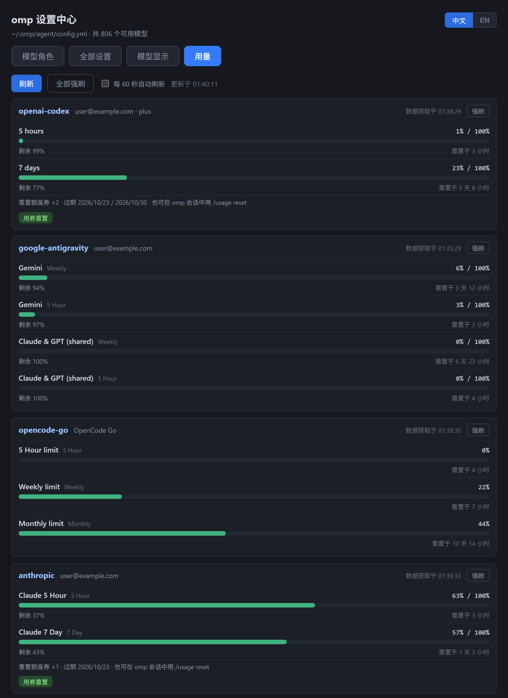
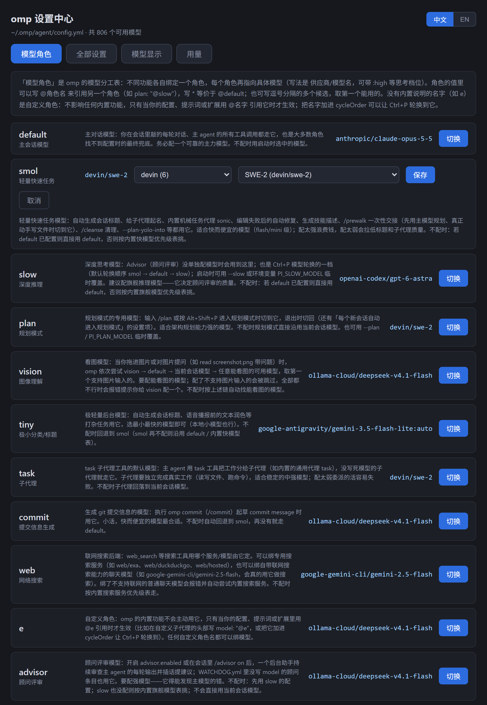
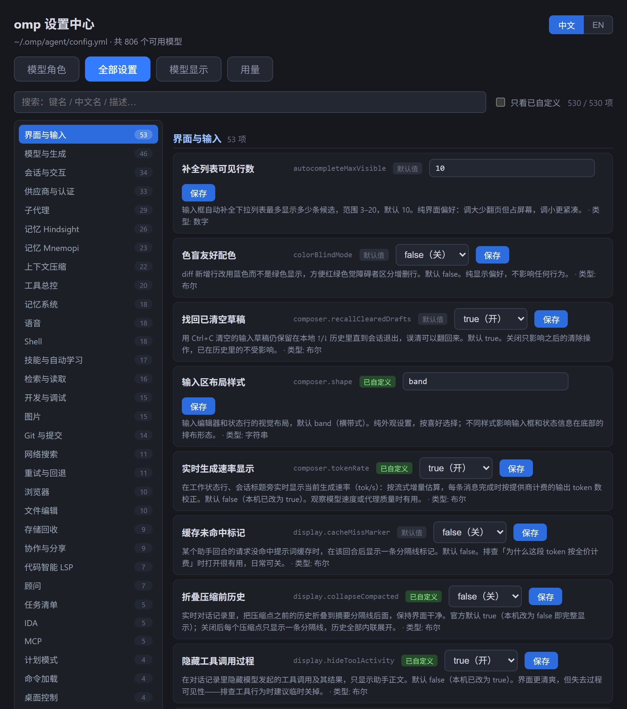
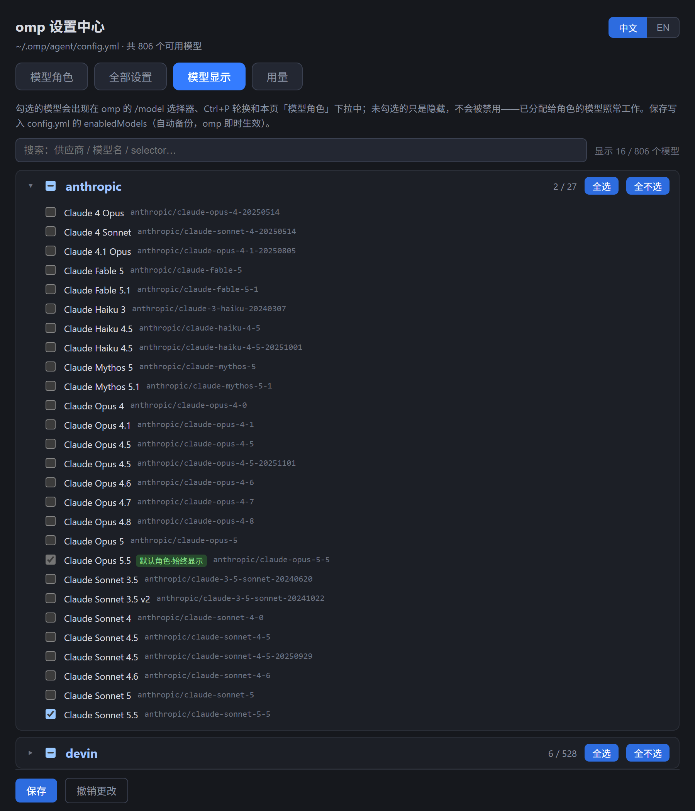

# omp 设置中心 (omp-settings-web)

**[English](README.md) | [中文](README_CN.md)**

## 截图

**桌面小窗**——贴在桌面层显示各供应商剩余额度（不遮挡其他应用）：


**用量面板**——按供应商的额度卡，支持强刷和用券重置：



**模型角色**——每个角色附新手说明，两级选择切换模型：



**全部设置**——529 项按大类侧栏导航，逐项中文说明：



**模型显示**——勾选哪些模型出现在 `/model` 选择器：



## 功能

**模型角色**

- 两级选择（供应商分组→组内模型），自动定位当前值，别名兜底。
- 每个角色下方显示详细新手向说明（该角色被哪些功能用、配什么模型、未配置时的回退行为），页顶有角色机制通用说明（@别名、*、逗号候选、自定义角色）。

**全部设置**

- 全量设置目录，含当前值/类型/描述。
- 全部 529 项均有面向初学者的详细中文说明（每个取值的效果、默认值、何时值得改、相关设置），上游英文原文悬停可见。
- 标量项可直接改，数组/嵌套块只读展示。
- 设置页按 ~35 个语义大类做侧栏导航（按项数排序），搜索时侧栏显示各组命中数、零命中置灰。
- 搜索 + 只看已自定义；徽章区分自定义项与默认值。

**模型显示**

- 按模型/按供应商勾选哪些模型出现在 omp 的 `/model` 选择器、Ctrl+P 轮换和本页角色下拉中；未勾选只是隐藏、不是禁用，已分配给角色的模型照常可用。写入 `enabledModels`（自动备份，omp 即时生效）。

**用量**

- 复刻 omp `/usage` 的可视面板：按供应商分卡的限额进度条（5 小时/7 天/周/月窗口）、已用与剩余量、重置倒计时实时跳动、账号/套餐信息与重置额度券；共享窗口自动去重。手动刷新 + 单供应商/全局「强刷」（`omp usage invalidate`，白名单校验）+ 可选 60 秒自动轮询，数据为空或拉取失败时给出提示而非白屏。anthropic / openai-codex 卡片支持「用券重置」——确认后经 omp `/usage reset` 同款上游协议消耗一张额度券（服务端复刻 `resets.ts`；OAuth token 从 `~/.omp/agent/agent.db` 读取，永不出进程）。

**桌面小窗** (`widget.py`)

- 贴桌面层的无边框暗色小窗（始终在所有应用窗口之下），直接读 `omp usage --json` 展示各供应商额度窗口（按剩余量着色的进度条、剩余百分比、重置倒计时、额度券角标）；独立运行不依赖网页服务，60 秒自动刷新，任意处拖动且记住位置，右键可刷新/强制刷新/打开网页面板/退出；防双开、Win11 圆角、高分屏清晰、调用 omp 不弹控制台。

## 依赖

- Python 3.8+（纯标准库，零第三方依赖）
- [omp](https://github.com/can1357/oh-my-pi) 已安装并在 `PATH` 上（用于 `omp models --json`）

## 使用

```bash
python server.py            # 启动 http://127.0.0.1:8788 并自动打开浏览器
python server.py --no-browser
```

桌面小窗：

```bash
pythonw widget.py           # 无控制台窗口；右键小窗调出菜单
```

打开页面 → 角色行点「切换」→ 选分组 → 选模型 → 保存。配置写入后 omp **即时生效**，运行中的会话无需重启。

## 安全设计

`omp config set` 会重写整个文件并抹掉你的注释，本工具从不调用它。而是：

1. **精准行编辑**——读取 `~/.omp/agent/config.yml`，只正则替换目标键的那一行；尚未存在的键按正确嵌套层级插入。
2. **字节级 IO**——`read_bytes`/`write_bytes` 并检测原文件行尾（LF vs CRLF），除被编辑/插入的行外其他内容逐字节不变。
3. **自动备份**——每次写入前先把配置复制为 `config.yml.bak-settings-web-<时间戳>`。
4. **类型校验**——按 `omp config list` 上报的类型做值转换（boolean/number/string/enum）；数组和嵌套块只读。

服务只绑定 `127.0.0.1`。所有写入前的值/角色输入都先过白名单正则。

> ⚠️ 值得一提的坑（也是 #2 存在的原因）：Windows 上 Python 的 `Path.write_text()` 会静默把 LF 翻译成 CRLF，整个配置文件的行尾都会被改写。

## API

| Endpoint | Method | Purpose |
|---|---|---|
| `/api/state` | GET | 当前角色（从 config.yml 解析）+ 全量模型目录（`omp models --json`） |
| `/api/set` | POST | `{"role": "...", "value": "..."}` — 备份 + 精准写入 |
| `/api/settings` | GET | 全量设置目录（`omp config list --json`）+ 中文注释 + `__groupmap` |
| `/api/set-key` | POST | `{"key": "...", "value": "..."}` — 类型化标量写入，备份 + 精准行编辑 |
| `/api/usage` | GET | `omp usage --json` 透传 — 按供应商的额度/用量报告 |
| `/api/usage/invalidate` | POST | `{"provider": "all"|<provider id>}` — 白名单校验的 `omp usage invalidate`，强制重抓 |
| `/api/usage/redeem` | POST | `{"provider": "anthropic"\|"openai-codex"}` — 消耗一张额度券（anthropic 两步 request_id 确认、openai-codex 单步幂等），结构化 `{ok, code, error}` 响应，token 永不外泄 |

## License

[MIT](LICENSE) — 与 omp 项目无关。
